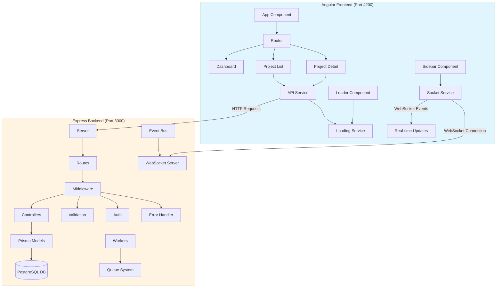
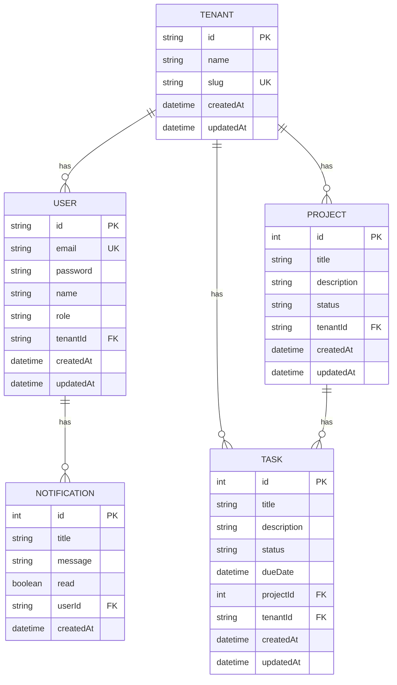

# Project Management Application - Complete Overview

A full-stack project management application built with **Node.js/Express** (TypeScript) backend and **Angular 19** (standalone components, zoneless) frontend, featuring real-time updates via WebSockets and multi-tenant architecture.

---

## Table of Contents

1. [Architecture Overview](#architecture-overview)
2. [Backend Architecture](#backend-architecture)
3. [Frontend Architecture](#frontend-architecture)
4. [Database Schema](#database-schema)
5. [API Endpoints](#api-endpoints)
6. [Real-time Integration](#real-time-integration)
7. [Recent Improvements](#recent-improvements)
8. [Technology Stack](#technology-stack)

---

## Architecture Overview


```

---

## Backend Architecture

### Directory Structure

```
backend/
├── config/
│   ├── prisma.ts            # Prisma client configuration
│   └── redis.ts             # Redis configuration
├── controllers/
│   ├── admin.controller.ts  # Admin operations
│   ├── auth.controller.ts   # Authentication logic
│   ├── project.controller.ts # Project CRUD
│   └── task.controller.ts   # Task CRUD
├── middleware/
│   ├── auth.middleware.ts   # JWT authentication
│   ├── error.middleware.ts  # Global error handler with console logging
│   ├── tenant.middleware.ts # Multi-tenant middleware
│   └── validation.middleware.ts # Zod validation
├── prisma/
│   └── schema.prisma        # Prisma database schema
├── routes/
│   ├── admin.routes.ts      # Admin endpoints
│   ├── auth.routes.ts       # Auth endpoints
│   ├── project.routes.ts    # Project endpoints
│   └── task.routes.ts       # Task endpoints
├── utils/
│   ├── AppError.ts          # Custom error class
│   ├── events.ts            # Event bus for real-time updates
│   ├── logger.ts            # Winston logger
│   └── schemas.ts           # Zod validation schemas
├── websocket.ts             # Socket.IO server setup
├── workers/
│   ├── heavy-computation.ts # Worker thread example
│   └── queue.ts             # BullMQ queue system
├── server.ts                # Express app entry point with clustering
└── package.json
```

### Core Components

#### 1. Server Configuration
**File**: [server.ts](file:///c:/Projects/nodejstest/backend/server.ts)

- Express app setup with CORS and body-parser
- Database initialization with Prisma
- WebSocket integration with Socket.IO
- Cluster mode for multi-core utilization
- Route registration
- Global error handling middleware with console logging
- Process-level error handlers for uncaught exceptions and unhandled rejections
- Runs on port 3000

#### 2. Database Schema (Prisma)

**Tenant Model**
```typescript
{
  id: string (UUID, primary key)
  name: string
  slug: string (unique)
  createdAt: DateTime
  updatedAt: DateTime
  users: User[]
  projects: Project[]
  tasks: Task[]
}
```

**User Model**
```typescript
{
  id: string (UUID, primary key)
  email: string (unique)
  password: string
  name: string?
  role: string (default: 'member')
  tenantId: string (foreign key)
  tenant: Tenant (relation)
  notifications: Notification[]
  createdAt: DateTime
  updatedAt: DateTime
}
```

**Project Model**
```typescript
{
  id: number (auto-increment, primary key)
  title: string
  description: string?
  status: string (default: 'active')
  tenantId: string? (foreign key, optional for migration)
  tenant: Tenant? (relation)
  tasks: Task[]
  createdAt: DateTime
  updatedAt: DateTime
}
```

**Task Model**
```typescript
{
  id: number (auto-increment, primary key)
  title: string
  description: string?
  status: string (default: 'todo')
  dueDate: DateTime?
  projectId: number? (foreign key)
  project: Project? (relation)
  tenantId: string? (foreign key)
  tenant: Tenant? (relation)
  createdAt: DateTime
  updatedAt: DateTime
}
```

**Notification Model**
```typescript
{
  id: number (auto-increment, primary key)
  title: string
  message: string
  read: boolean (default: false)
  userId: string (foreign key)
  user: User (relation)
  createdAt: DateTime
}
```

**Relationships**: Tenant hasMany Users/Projects/Tasks, User belongsTo Tenant, Project belongsTo Tenant and hasMany Tasks, Task belongsTo Project and Tenant.

#### 3. Controllers

**Project Controller** - [project.controller.ts](file:///c:/Projects/nodejstest/backend/controllers/project.controller.ts)
- `getAllProjects()` - Fetch all projects (with tenant filtering)
- `createProject()` - Create new project and emit 'project:created' event
- `getProjectById()` - Fetch single project
- `deleteProject()` - Delete project and emit 'project:deleted' event

**Task Controller** - [task.controller.ts](file:///c:/Projects/nodejstest/backend/controllers/task.controller.ts)
- `getTasksByProject()` - Fetch tasks for a project
- `createTask()` - Create new task and emit 'task:created' event
- `updateTask()` - Update task
- `deleteTask()` - Delete task

**Auth Controller** - [auth.controller.ts](file:///c:/Projects/nodejstest/backend/controllers/auth.controller.ts)
- Authentication logic (placeholder)

**Admin Controller** - [admin.controller.ts](file:///c:/Projects/nodejstest/backend/controllers/admin.controller.ts)
- Administrative operations

#### 4. Middleware

**Validation Middleware** - [validation.middleware.ts](file:///c:/Projects/nodejstest/backend/middleware/validation.middleware.ts)
- Uses **Zod** for request validation
- Validates request body against schemas
- Returns 400 with error messages on validation failure

**Error Middleware** - [error.middleware.ts](file:///c:/Projects/nodejstest/backend/middleware/error.middleware.ts)
- Global error handler with console.log logging for every error
- Catches all errors and formats responses
- Logs errors to console for visibility

**Auth Middleware** - [auth.middleware.ts](file:///c:/Projects/nodejstest/backend/middleware/auth.middleware.ts)
- JWT token verification (placeholder)

**Tenant Middleware** - [tenant.middleware.ts](file:///c:/Projects/nodejstest/backend/middleware/tenant.middleware.ts)
- Extracts tenant ID from request for multi-tenancy

#### 5. WebSocket Integration
**File**: [websocket.ts](file:///c:/Projects/nodejstest/backend/websocket.ts)

- Socket.IO server setup
- Listens to event bus events and broadcasts to connected clients
- Supports tenant-specific rooms for multi-tenancy

#### 6. Event Bus
**File**: [events.ts](file:///c:/Projects/nodejstest/backend/utils/events.ts)

- Custom event emitter for decoupling
- Emits events like 'project:created', 'task:created', 'project:deleted'
- WebSocket server subscribes to these events

#### 7. Workers and Queues
**Files**: [workers/queue.ts](file:///c:/Projects/nodejstest/backend/workers/queue.ts), [workers/heavy-computation.ts](file:///c:/Projects/nodejstest/backend/workers/heavy-computation.ts)

- BullMQ for job queues
- Redis-backed queue system
- Heavy computation worker example

#### 8. Validation Schemas

**File**: [schemas.ts](file:///c:/Projects/nodejstest/backend/utils/schemas.ts)

Zod schemas for:
- Project creation/update
- Task creation/update
- Request validation

#### 9. Utilities

**Logger** - [logger.ts](file:///c:/Projects/nodejstest/backend/utils/logger.ts)
- Winston-based logging
- Console and file transports
- Different log levels (info, warn, error)

**AppError** - [AppError.ts](file:///c:/Projects/nodejstest/backend/utils/AppError.ts)
- Custom error class extending Error
- Includes statusCode and isOperational flag
- Authentication logic (if implemented)

**Admin Controller** - [admin.controller.ts](file:///c:/Projects/nodejstest/backend/controllers/admin.controller.ts)
- Administrative operations

#### 4. Middleware

**Validation Middleware** - [validation.middleware.ts](file:///c:/Projects/nodejstest/backend/middleware/validation.middleware.ts)
- Uses **Zod** for request validation
- Validates request body against schemas
- Returns 400 with error messages on validation failure
- Uses `ZodType` (not deprecated `ZodSchema`)

**Error Middleware** - [error.middleware.ts](file:///c:/Projects/nodejstest/backend/middleware/error.middleware.ts)
- Global error handler
- Catches all errors and formats responses
- Logs errors using Winston
- Returns appropriate HTTP status codes

**Auth Middleware** - [auth.middleware.ts](file:///c:/Projects/nodejstest/backend/middleware/auth.middleware.ts)
- JWT token verification
- Protects routes requiring authentication

#### 5. Validation Schemas

**File**: [schemas.ts](file:///c:/Projects/nodejstest/backend/utils/schemas.ts)

Zod schemas for:
- Project creation/update
- Task creation/update
- Request validation

#### 6. Utilities

**Logger** - [logger.ts](file:///c:/Projects/nodejstest/backend/utils/logger.ts)
- Winston-based logging
- Console and file transports
- Different log levels (info, warn, error)

**AppError** - [AppError.ts](file:///c:/Projects/nodejstest/backend/utils/AppError.ts)
- Custom error class extending Error
- Includes statusCode and isOperational flag

---

## Frontend Architecture

### Directory Structure

```
frontend/src/app/
├── components/
│   ├── dashboard/
│   │   ├── dashboard.ts
│   │   ├── dashboard.html
│   │   └── dashboard.css
│   ├── loader/
│   │   ├── loader.component.ts
│   │   ├── loader.component.html
│   │   └── loader.component.css
│   ├── project-detail/
│   │   ├── project-detail.ts
│   │   ├── project-detail.html
│   │   └── project-detail.css
│   ├── project-list/
│   │   ├── project-list.ts
│   │   ├── project-list.html
│   │   └── project-list.css
│   ├── sidebar/
│   │   ├── sidebar.component.ts
│   │   ├── sidebar.component.html
│   │   └── sidebar.component.css
│   └── task-form/
│       ├── task-form.ts
│       ├── task-form.html
│       └── task-form.css
├── interfaces/
│   ├── project.interface.ts
│   └── task.interface.ts
├── services/
│   ├── api.service.ts
│   ├── loading.service.ts
│   └── socket.service.ts
├── app.ts
├── app.html
├── app.css
├── app.config.ts
└── app.routes.ts
```

### Core Components

#### 1. App Component
**Files**: [app.ts](file:///c:/Projects/nodejstest/frontend/src/app/app.ts), [app.html](file:///c:/Projects/nodejstest/frontend/src/app/app.html), [app.css](file:///c:/Projects/nodejstest/frontend/src/app/app.css)

- Root component with Material toolbar and sidebar layout
- Navigation links (Dashboard, Projects)
- Router outlet for child routes
- Global loader component
- Real-time sidebar for websocket events
- Connects to WebSocket on init and listens for global notifications

#### 2. Sidebar Component
**Files**: [sidebar.component.ts](file:///c:/Projects/nodejstest/frontend/src/app/components/sidebar/sidebar.component.ts), [sidebar.component.html](file:///c:/Projects/nodejstest/frontend/src/app/components/sidebar/sidebar.component.html), [sidebar.component.css](file:///c:/Projects/nodejstest/frontend/src/app/components/sidebar/sidebar.component.css)

**Features:**
- Displays real-time websocket messages
- Subscribes to 'project:created', 'task:created', 'notification' events
- Shows timestamped messages in a scrollable list
- Keeps last 50 messages
- Empty state when no events

#### 3. Dashboard Component
**Files**: [dashboard.ts](file:///c:/Projects/nodejstest/frontend/src/app/components/dashboard/dashboard.ts)

- Landing page
- Overview of application

#### 4. Project List Component
**Files**: [project-list.ts](file:///c:/Projects/nodejstest/frontend/src/app/components/project-list/project-list.ts), [project-list.html](file:///c:/Projects/nodejstest/frontend/src/app/components/project-list/project-list.html), [project-list.css](file:///c:/Projects/nodejstest/frontend/src/app/components/project-list/project-list.css)

**Features:**
- Grid layout of project cards
- Create new project form
- Status badges (active/completed/archived)
- Empty state when no projects
- Hover animations on cards
- Click to navigate to project details
- Real-time updates via websocket listeners

**State Management:**
- `projects: Project[]` - List of all projects
- `newProjectTitle: string` - Form input
- `newProjectDesc: string` - Form input

#### 5. Project Detail Component
**Files**: [project-detail.ts](file:///c:/Projects/nodejstest/frontend/src/app/components/project-detail/project-detail.ts), [project-detail.html](file:///c:/Projects/nodejstest/frontend/src/app/components/project-detail/project-detail.html), [project-detail.css](file:///c:/Projects/nodejstest/frontend/src/app/components/project-detail/project-detail.css)

**Features:**
- Gradient header with project info
- Task list with status indicators
- Add task form with Enter key support
- Delete task functionality
- Empty state when no tasks
- Color-coded task statuses

**State Management:**
- `project: Project | null` - Current project
- `tasks: Task[]` - Project tasks
- `newTaskTitle: string` - Form input

#### 6. Loader Component
**Files**: [loader.component.ts](file:///c:/Projects/nodejstest/frontend/src/app/components/loader/loader.component.ts), [loader.component.html](file:///c:/Projects/nodejstest/frontend/src/app/components/loader/loader.component.html), [loader.component.css](file:///c:/Projects/nodejstest/frontend/src/app/components/loader/loader.component.css)

**Features:**
- Global loading overlay
- Glassmorphism effect with backdrop blur
- Material spinner
- Smooth fade-in/scale-in animations
- High z-index (9999) to appear above all content

### Services

#### 1. API Service
**File**: [api.service.ts](file:///c:/Projects/nodejstest/frontend/src/app/services/api.service.ts)

**Methods:**
- `getProjects()` - Fetch all projects
- `getProject(id)` - Fetch single project
- `createProject(project)` - Create project
- `deleteProject(id)` - Delete project
- `getTasks(projectId)` - Fetch tasks for project
- `createTask(task)` - Create task
- `updateTask(id, task)` - Update task
- `deleteTask(id)` - Delete task

**Features:**
- Automatic loading state management
- Uses RxJS `finalize` operator
- Maps API responses to data objects
- Injects `LoadingService` for global loader

#### 2. Socket Service
**File**: [socket.service.ts](file:///c:/Projects/nodejstest/frontend/src/app/services/socket.service.ts)

**Features:**
- Socket.IO client for real-time communication
- Connects to backend WebSocket server
- Generic `onEvent<T>()` method for subscribing to events
- Connection state management with signals
- Auto-reconnect and error handling

#### 3. Loading Service
**File**: [loading.service.ts](file:///c:/Projects/nodejstest/frontend/src/app/services/loading.service.ts)

**Features:**
- Signal-based reactive state (`signal<boolean>`)
- Request counting for concurrent calls
- `show()` and `hide()` methods
- Readonly `isLoading` signal for components

### Interfaces

**Project Interface** - [project.interface.ts](file:///c:/Projects/nodejstest/frontend/src/app/interfaces/project.interface.ts)
```typescript
interface Project {
  id: number;
  title: string;
  description: string;
  status: 'active' | 'completed' | 'archived';
  createdAt: Date;
  updatedAt: Date;
}
```

**Task Interface** - [task.interface.ts](file:///c:/Projects/nodejstest/frontend/src/app/interfaces/task.interface.ts)
```typescript
interface Task {
  id: number;
  title: string;
  status: 'todo' | 'in-progress' | 'done';
  projectId: number;
  createdAt: Date;
  updatedAt: Date;
}
```

### Routing

**File**: [app.routes.ts](file:///c:/Projects/nodejstest/frontend/src/app/app.routes.ts)

```typescript
Routes = [
  { path: '', redirectTo: '/dashboard', pathMatch: 'full' },
  { path: 'dashboard', component: Dashboard },
  { path: 'projects', component: ProjectList },
  { path: 'projects/:id', component: ProjectDetail }
]
```

---

## Database Schema

### PostgreSQL Database with Prisma ORM
**File**: `backend/prisma/schema.prisma`



---

## API Endpoints

### Base URL
`http://localhost:3000/api`

### Projects

| Method | Endpoint | Description | Request Body |
|--------|----------|-------------|--------------|
| GET | `/projects` | Get all projects | - |
| GET | `/projects/:id` | Get project by ID | - |
| POST | `/projects` | Create project | `{ title, description, status }` |
| PUT | `/projects/:id` | Update project | `{ title?, description?, status? }` |
| DELETE | `/projects/:id` | Delete project | - |

### Tasks

| Method | Endpoint | Description | Request Body |
|--------|----------|-------------|--------------|
| GET | `/tasks` | Get all tasks | - |
| GET | `/tasks/project/:projectId` | Get tasks by project | - |
| POST | `/tasks` | Create task | `{ title, status, projectId }` |
| PUT | `/tasks/:id` | Update task | `{ title?, status? }` |
| DELETE | `/tasks/:id` | Delete task | - |

### Response Format

**Success Response:**
```json
{
  "status": "success",
  "data": {
    "projects": [...] // or "project", "tasks", "task"
  }
}
```

**Error Response:**
```json
{
  "status": "error",
  "message": "Error description"
}
```

---

## Real-time Integration

The application features real-time updates using WebSockets via Socket.IO, enabling instant UI updates without polling.

### Backend WebSocket Flow
1. **Event Emission**: Controllers emit events to the `eventBus` (e.g., `EVENTS.PROJECT.CREATED`)
2. **WebSocket Broadcasting**: `websocket.ts` listens to event bus and broadcasts to connected clients
3. **Tenant Isolation**: Events are broadcast to tenant-specific rooms for multi-tenancy

### Frontend WebSocket Flow
1. **Connection**: `SocketService` connects to backend WebSocket server on app init
2. **Event Subscription**: Components subscribe to events like `'project:created'`, `'task:created'`
3. **UI Updates**: Real-time sidebar displays events; components refresh data automatically
4. **Notifications**: SnackBar shows user-friendly notifications for global events

### Supported Events
- `project:created` - Triggered when a new project is created
- `task:created` - Triggered when a new task is added
- `project:deleted` - Triggered when a project is deleted
- `notification` - General notifications

### Integration Benefits
- **Instant Updates**: UI reflects changes immediately without manual refresh
- **Reduced API Calls**: No need for polling endpoints
- **Better UX**: Users see live activity in the sidebar
- **Scalable**: Event-driven architecture supports future real-time features

---

## Recent Improvements

### 1. Backend Modernization
- ✅ Migrated from Sequelize to Prisma ORM with PostgreSQL
- ✅ Added multi-tenant architecture with Tenant, User, Project, Task, Notification models
- ✅ Implemented WebSocket integration with Socket.IO for real-time updates
- ✅ Added event bus system for decoupling backend events
- ✅ Integrated BullMQ for job queues and Redis for caching
- ✅ Enhanced error logging: console.log every error in middleware and process handlers
- ✅ Fixed DATABASE_URL encoding for special characters

### 2. Frontend Real-time Features
- ✅ Added realtime sidebar component displaying live WebSocket events
- ✅ Integrated SocketService for WebSocket client communication
- ✅ Updated project list to use Angular directives (*ngIf/*ngFor) for proper rendering
- ✅ Added error handling and logging in API calls

### 3. UI Enhancements

#### Loading Infrastructure
- ✅ Created signal-based `LoadingService`
- ✅ Built reusable `LoaderComponent` with glassmorphism
- ✅ Integrated automatic loading on all API calls

#### Modern Design System
- ✅ Implemented CSS variables for theming
- ✅ Added smooth animations (fade-in, slide-up, scale)
- ✅ Enhanced Material components with custom styling
- ✅ Custom scrollbar styling

#### Component Improvements
- ✅ **Project List**: Grid layout, hover effects, status badges, empty state, realtime updates
- ✅ **Project Detail**: Gradient header, color-coded statuses, empty state
- ✅ **Sidebar**: Real-time event display with timestamps
- ✅ Enter key support for adding tasks
- ✅ Removed debug text

#### Design Highlights
- **Color Palette**: Indigo primary, pink accent, green success, amber warning
- **Animations**: Fade-in, slide-up with bounce, scale on hover
- **UX**: Loading feedback, empty states, status indicators, keyboard support, realtime updates

---

## Technology Stack

### Backend
- **Runtime**: Node.js with clustering
- **Framework**: Express.js
- **Language**: TypeScript
- **Database**: PostgreSQL with Prisma ORM
- **WebSockets**: Socket.IO for real-time communication
- **Queues**: BullMQ with Redis
- **Validation**: Zod
- **Logging**: Winston with console logging
- **Authentication**: JWT (placeholder)
- **Multi-tenancy**: Tenant-based isolation

### Frontend
- **Framework**: Angular 19
- **Language**: TypeScript
- **UI Library**: Angular Material
- **Architecture**: Standalone components, zoneless change detection
- **State Management**: Signals
- **HTTP Client**: Angular HttpClient with RxJS
- **WebSockets**: Socket.IO client
- **Routing**: Angular Router

### Infrastructure
- **Database**: PostgreSQL (via Docker)
- **Cache/Queues**: Redis (via Docker)
- **Message Broker**: RabbitMQ (via Docker)

### Development Tools
- **Package Manager**: npm
- **ORM**: Prisma CLI
- **TypeScript Compiler**: tsc
- **Dev Server**: ts-node (backend), ng serve (frontend)
- **Containerization**: Docker Compose

---

## Running the Application

### Prerequisites
- Node.js 18+
- Docker and Docker Compose
- PostgreSQL, Redis, RabbitMQ running (or use Docker Compose)

### Setup
```bash
# Start infrastructure (DB, Redis, RabbitMQ)
docker compose up -d

# Backend setup
cd backend
npm install
npx prisma generate
npx prisma db push  # Or npx prisma migrate dev --name init
npm start  # Runs on http://localhost:3000

# Frontend setup (new terminal)
cd frontend
npm install
npm start  # Runs on http://localhost:4200
```

### Alternative: Full Docker Setup
```bash
# Build and run everything with Docker Compose
docker compose -f docker-compose.full.yml up --build
```

---

## Project Features

### Current Features
- ✅ Multi-tenant project and task management
- ✅ Real-time updates via WebSockets
- ✅ Create, read, update, delete projects and tasks
- ✅ Project-task relationship management
- ✅ Status tracking (projects and tasks)
- ✅ Global loading indicator
- ✅ Modern, responsive UI with realtime sidebar
- ✅ Input validation with Zod
- ✅ Enhanced error handling and console logging
- ✅ Empty states for better UX
- ✅ Job queues with BullMQ
- ✅ Event-driven architecture

### Potential Enhancements
- 🔄 User authentication and authorization
- 🔄 Task assignment to users
- 🔄 Due dates and reminders
- 🔄 File attachments
- 🔄 Comments on tasks
- 🔄 Search and filtering
- 🔄 Sorting options
- 🔄 Pagination for large datasets
- 🔄 Dark mode toggle
- 🔄 Advanced notifications and email integration

---

## Architecture Decisions

### Backend
- **TypeScript**: Type safety and better developer experience
- **Sequelize**: ORM for easier database operations
- **Zod**: Runtime validation with TypeScript integration
- **Controller Pattern**: Separation of concerns
- **Middleware Chain**: Modular request processing

### Frontend
- **Standalone Components**: Modern Angular architecture
- **Zoneless**: Better performance without Zone.js
- **Signals**: Reactive state management
- **Material Design**: Consistent, accessible UI
- **Service Layer**: Centralized API communication
- **Loading Service**: Global loading state management

---

## Conclusion

This is a modern, full-stack project management application with:
- **Real-time Capabilities**: WebSocket integration for instant UI updates
- **Multi-tenant Architecture**: Tenant-based isolation with PostgreSQL and Prisma
- **Event-Driven Design**: Decoupled backend with event bus and job queues
- **Clean Architecture**: Separation of concerns on both frontend and backend
- **Type Safety**: TypeScript throughout the stack
- **Modern Practices**: Signals, standalone components, Zod validation, Prisma ORM
- **Great UX**: Loading states, animations, empty states, responsive design, realtime sidebar
- **Scalable**: Easy to extend with new features like authentication and advanced notifications

The application demonstrates best practices in both Node.js/Express backend development and Angular frontend development, with a focus on maintainability, performance, and real-time user experience.
